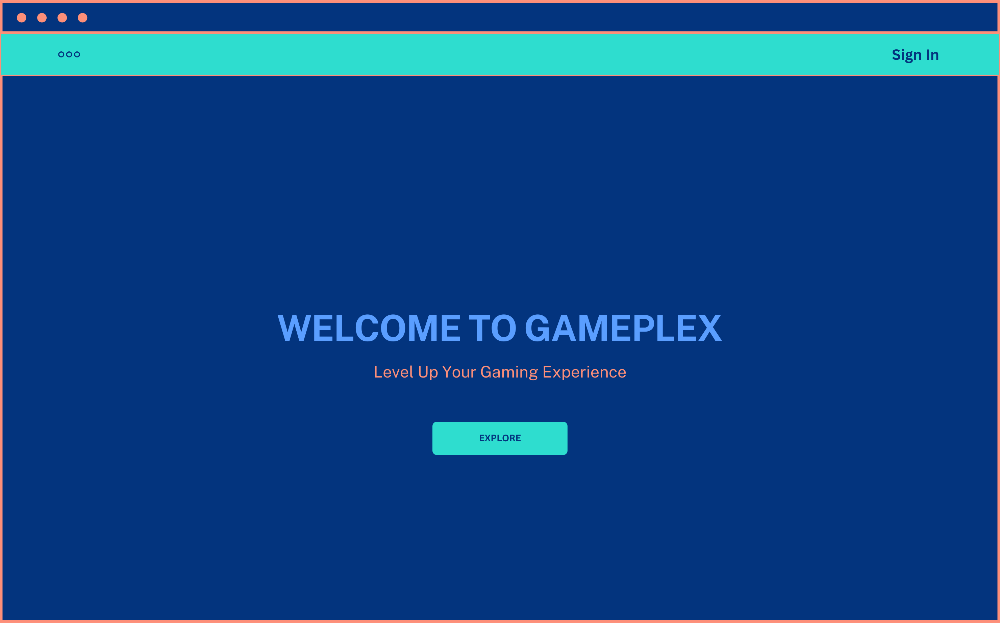
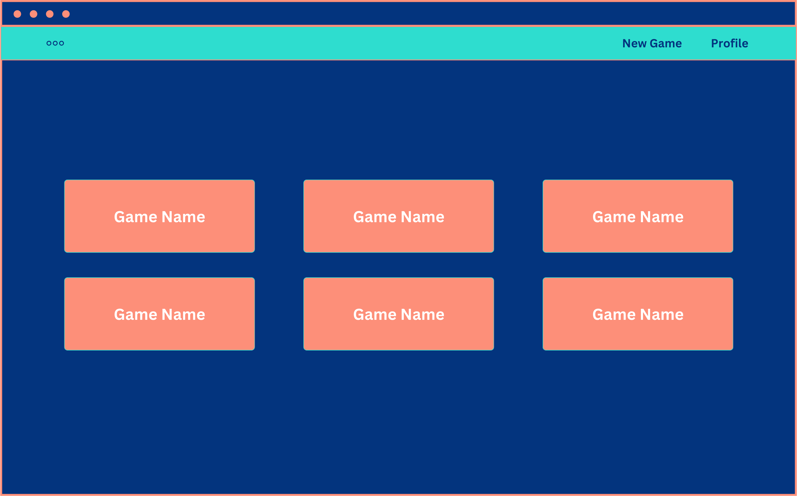
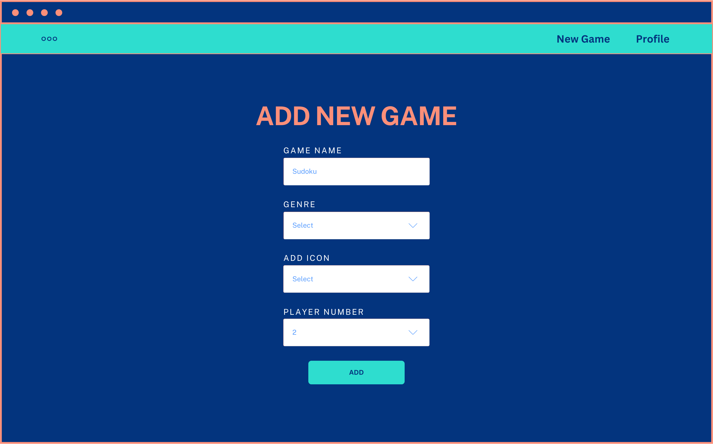
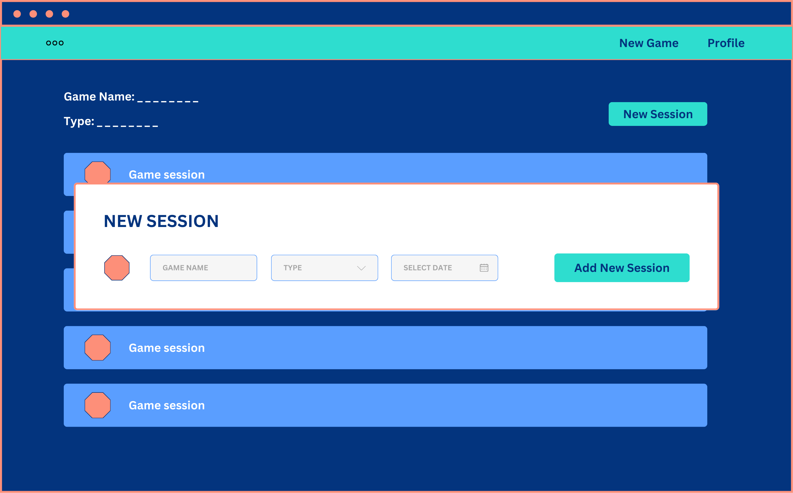
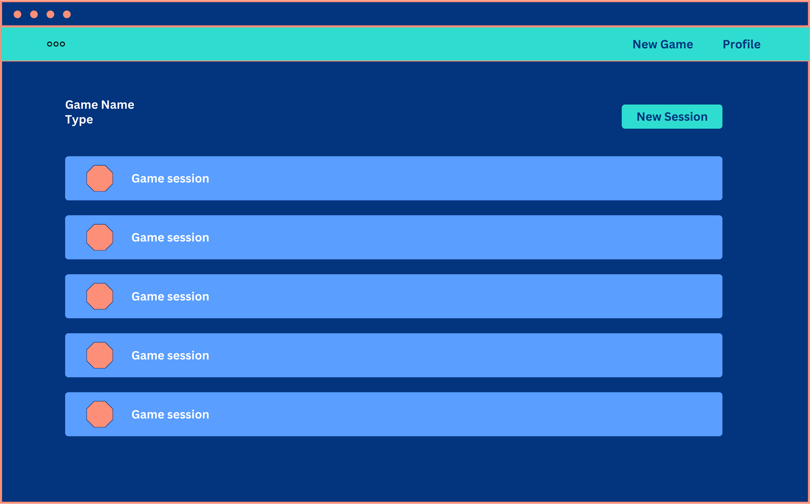
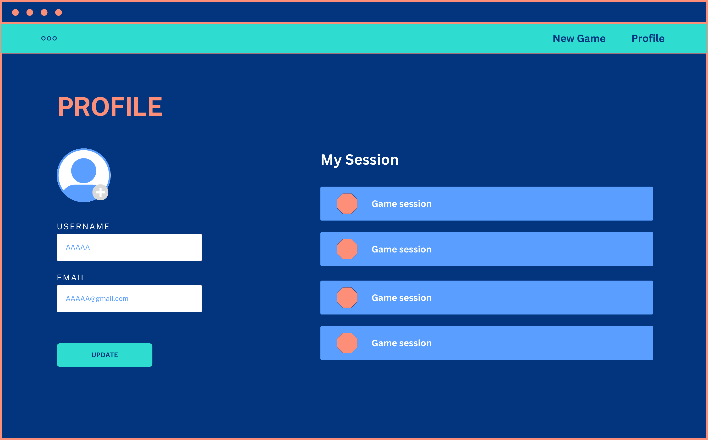

# GAMEPLEX

## Date : 2/7/2024

### Made By:  
## Shaikha Ebrahim  - Jassim Ahmed  - Fatima Fouad

### **_Description_**
GamePlex is a website to book sessions for games.
You can book sessions with people online, Also you acn specify the number of players you like to book your session, and many more.


[Trello Board](https://trello.com/b/YZLaovCr/gameplex
)

---
### **_Game Link:_**
##### Live Link: [GAMEPLEEX](https://gameplex.fly.dev/)
---
### Screenshots:
## ERD:
## 
## Wireframe:
## Home Page  
## Games List 
## Add New Game 
## Booking Sessions 
## Booked Sessions 
## Game Session 
## Profile Page 

## Website:


### Technologies used

- [x] VSCode (Editor for Writing the Code)
- [x] HTML (Structure of the pages)
- [x] CSS (Style of the pages)
- [x] EJS (MockUp Frontend)
- [x] Express (API Calls)
- [x] MongoDB (Databse)
- [x] JavaScript (Functionality for the pages)
- [x] Canva (Early map desgin of the game)
- [x] Google Fonts (Fonts for the page)
- [x] Trelllo (Managment for the work)
- [x] Drawio (ERD for the database)

---
### What we have learned:

- [x] CSS.
- [x] EJS.
- [x] MongoDB.

---
### What we are most proud of is :
## Creating a session for a game:
```
const createSession = async (req, res) => {
  try {
    console.log(req.user)
    const session = new Session({
      playerIds: [],
      location: req.body.location,
      date: req.body.date,
      gameId: req.params.id,
      max: req.body.max
    })
    session.playersIds.push(req.user._id)
    await session.save()
    const game = await Game.findById(req.params.id)
    game.sessionIds.push(session._id)
    await game.save()
    const user = await User.findById(req.user._id)
    user.sessionsId.push(session._id)
    await user.save()

    res.redirect(`/games/${req.params.id}`)
  } catch (err) {
    console.log(err)
    res.redirect(`/games/${req.params.id}`)
  }
}
```

## Search function for the games:
```
 const searchInput = document.getElementById('searchInput');
  const cards = document.querySelectorAll('.card');
  searchInput.addEventListener('input', function() {
    const searchTerm = this.value.toLowerCase().trim();
    cards.forEach(card => {
      const title = card.querySelector('.card__title').textContent.toLowerCase();
      const description = card.querySelector('.card__description').textContent.toLowerCase();
    
      if (title.includes(searchTerm) || description.includes(searchTerm)) {
        card.parentElement.style.display = 'flex'; 
        card.style.display = 'block'; 
      } else {
        card.parentElement.style.display = 'none'; 
        card.style.display = 'none'; 
      }
    });
  });

```
---
### Future plans:

- [ ] Improve the design.
- [ ] Automatically delete or archive sessions when they end.


---
### **_Credits_**

##### Canva: [Canva](https://www.canva.com/)
##### Drawio: [Draw](https://app.diagrams.net/)

