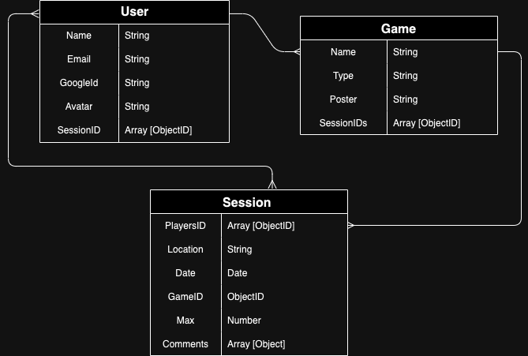
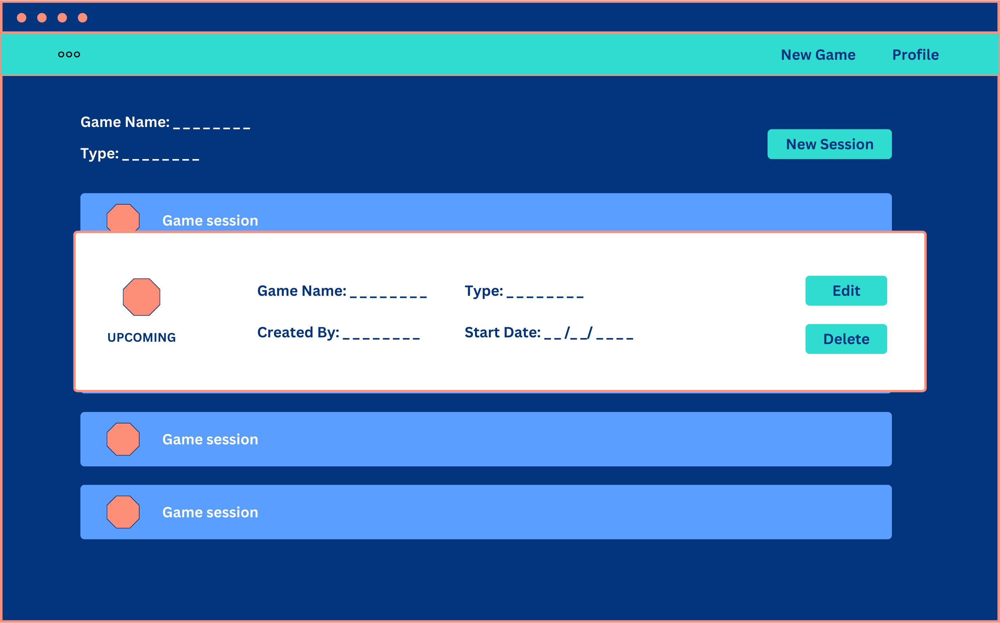

# GAMEPLEX

## Date : 2/7/2024

### Made By:  
## Shaikha Ebrahim  - Jassim Ahmed  - Fatima Fouad

### **_Description_**
GamePlex is a website to book sessions for games.
You can book sessions with people online, Also you acn specify the number of players you like to book your session, and many more.

[Trello Board](https://trello.com/b/YZLaovCr/gameplex
)

---
### **_Game Link:_**
##### Live Link:
---
### Screenshots:
## ERD:
## 
## Wireframe:
## Home Page  
## Games List 
## Add New Game 
## Booking Sessions 
## Booked Sessions 
## Game Session 
## Profile Page 

### Technologies used

- [x] VSCode (Editor for Writing the Code)
- [x] HTML (Structure of the pages)
- [x] CSS (Style of the pages)
- [x] Express (API Calls)
- [x] MongoDB (Databse)
- [x] JavaScript (Functionality for the pages)
- [x] Canva (Early map desgin of the game)
- [x] Google Fonts (Fonts for the page)
- [x] Trelllo (Managment for the work)

---
### What we have learned:

- [x] 

---
### What we are most proud of is :

---
### Future plans:

- [ ] 

---
### **_Credits_**

##### Canva: [Canva](https://www.canva.com/)
